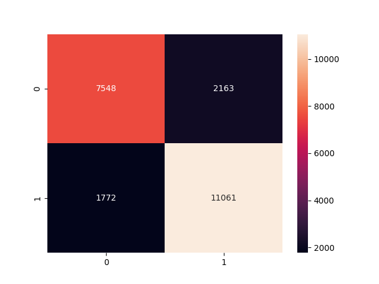
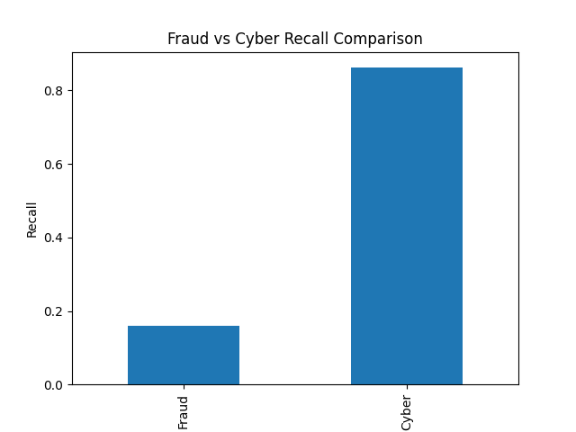

# Cross-Domain Anomaly Detection  
### Fraud Detection vs Cyber Intrusion Detection

> A single anomaly detection approach applied across two fundamentally different domains.

---

## Overview

This project investigates a fundamental question: **Can the same anomaly detection approach work across completely different domains?**

Two real-world problems are explored:

- Financial Fraud Detection  
- Cyber Intrusion Detection  

Although these problems seem unrelated, they share the same core structure: **Normal behavior vs abnormal behavior**

Instead of treating them separately, this project approaches both through a unified anomaly detection framework.

---

## Why This Matters (Real-World Context)

In real systems:

- Banks monitor transactions to detect fraud  
- Security teams monitor network traffic to detect intrusions  

Both problems are essentially: **detecting rare, abnormal patterns in large volumes of normal data**

This project demonstrates how the same analytical mindset applies to both domains — while also highlighting how **data characteristics change model behavior**.

---

## Datasets

- [Credit Card Fraud Detection](https://www.kaggle.com/datasets/mlg-ulb/creditcardfraud)  
- [NSL-KDD Intrusion Detection](https://www.kaggle.com/datasets/hassan06/nslkdd)

---

## System Design

The project is designed as an end-to-end anomaly detection pipeline:

PostgreSQL → Data Analysis → Feature Engineering → Anomaly Detection → Evaluation → Cross-Domain Comparison

### Technologies Used

- PostgreSQL (data storage)  
- DBeaver (database management)  
- Python (analysis & modeling)  
- Jupyter Notebook (experimentation)

---

## Notebooks

The full analysis and modeling process is documented in the following [notebooks](notebooks). Each notebook represents a step in the end-to-end anomaly detection pipeline:

- [01_data_audit.ipynb](notebooks/01_data_audit.ipynb) → Data understanding, cleaning, and feature analysis  
- [02_creditcard_model.ipynb](notebooks/02_creditcard_model.ipynb) → Fraud detection modeling and evaluation  
- [03_nsl_kdd_model.ipynb](notebooks/03_nsl_kdd_model.ipynb) → Cyber intrusion detection using anomaly detection  
- [04_comparison.ipynb](notebooks/04_comparison.ipynb) → Cross-domain comparison and final insights

---

## Financial Fraud Detection

### Data Understanding

The dataset is highly imbalanced:

Fraudulent transactions represent a very small portion of the data.

This justifies the use of anomaly detection methods.

---

### Key Insight

Fraud patterns are **subtle**:

- Fraud transactions overlap with normal behavior  
- No strong separation in time or amount  
- Anomalies are weak and difficult to isolate  

---

### Model Results

| Model | Recall | Precision |
|------|--------|----------|
| Isolation Forest | 0.16 | 0.16 |
| LOF | 0.00 | 0.00 |

Isolation Forest performs better, but overall detection remains challenging.

---

## Cyber Intrusion Detection

### Data Behavior

Unlike fraud, cyber attacks show more structured patterns:

- Protocol usage differs  
- Service patterns change  
- Behavior is more distinguishable  

---

### Model Results

| Model | Recall |
|------|--------|
| Isolation Forest | 0.86 |
| LOF | 0.43 |

Anomalies are significantly easier to detect compared to financial fraud.

---

### Example Model Output

---

## Cross-Domain Comparison

| Domain | Best Model | Recall |
|--------|-----------|--------|
| Fraud  | Isolation Forest | 0.16 |
| Cyber  | Isolation Forest | 0.86 |

This gap highlights how anomaly detection performance is driven by data structure rather than the model itself.
---

### Key Finding

> The same model behaves completely differently depending on the nature of the data.

- Fraud → weak, overlapping anomalies  
- Cyber → strong, structured anomalies

--- 

## Interpretation

This project reveals an important insight: **Anomaly detection is not domain-specific — but performance is data-dependent**

---

## Additional Visualizations

More detailed visualizations can be found in the [images](images) folder:

- Feature correlations  
- Model comparisons  
- LOF vs Isolation Forest behavior  
- Distribution analysis  

---

## Final Conclusion

> The same anomaly detection approach can be applied across domains —  
> but understanding the nature of the data is critical for interpreting model performance.

This is what differentiates a simple model implementation from a real-world analytical solution.
