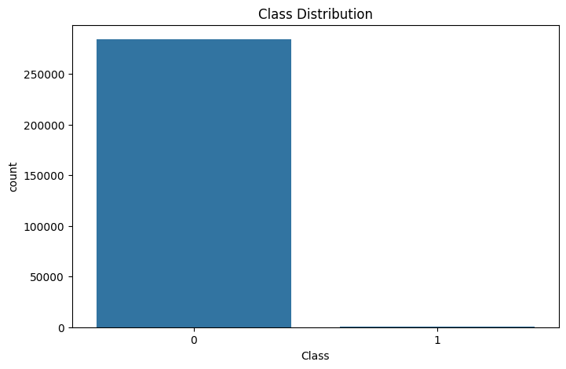
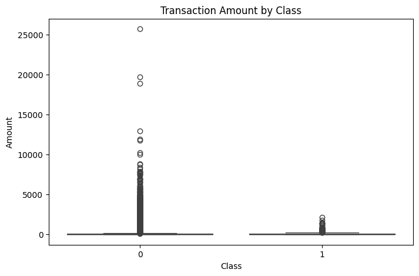
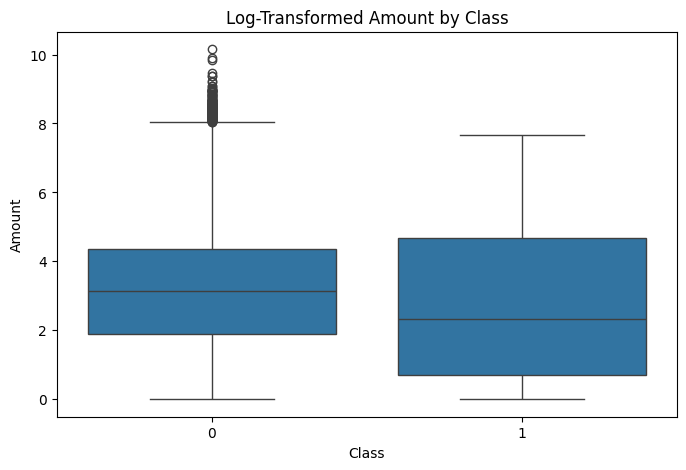
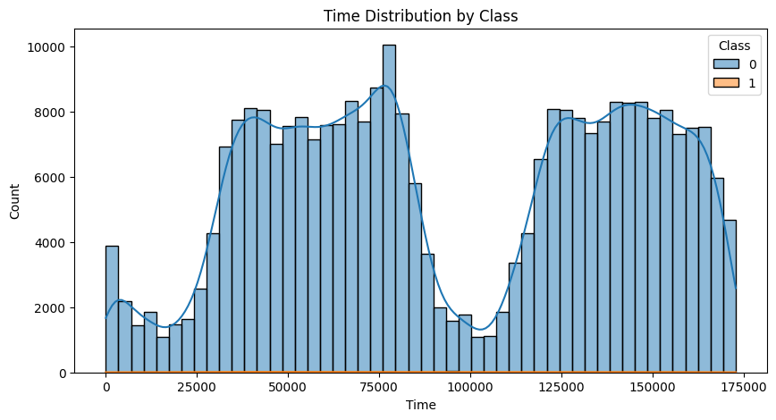
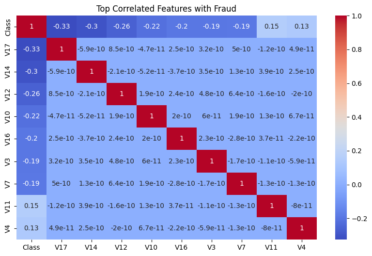
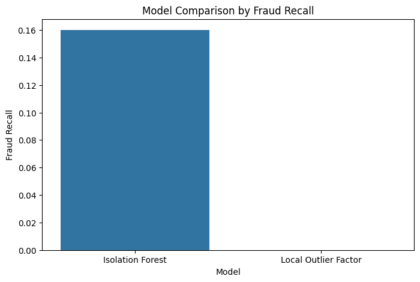

# Anomaly Detection Across Finance and Cyber Security

## Project Overview

This project explores anomaly detection across two different domains:

- Financial Fraud Detection ([Credit Card Fraud Detection](https://www.kaggle.com/datasets/mlg-ulb/creditcardfraud))
- Cyber Attack Detection ([NSL-KDD Intrusion Detection](https://www.kaggle.com/datasets/hassan06/nslkdd))

The goal is to understand how the same anomaly detection mindset can be applied to both finance and cyber security, where the common problem is: **Normal Behavior vs Abnormal Behavior**

Instead of treating fraud detection and cyber attack detection as separate problems, this project approaches both as anomaly detection tasks.

This project currently focuses on the financial fraud detection side and builds the foundation for future cyber security analysis.

The workflow followed in this project:

PostgreSQL → Python EDA → Feature Engineering → Anomaly Detection Models → Model Comparison

The objective is not only to detect fraud, but also to understand anomaly behavior, compare model performance, and build a strong portfolio-level analytics project.

---

## Datasets
- [Credit Card Fraud Detection](https://www.kaggle.com/datasets/mlg-ulb/creditcardfraud)
- [NSL-KDD Intrusion Detection](https://www.kaggle.com/datasets/hassan06/nslkdd)

---

## PostgreSQL Database Setup

All datasets were stored inside PostgreSQL for centralized querying and structured analysis.

Database used:

`anomaly_detection_db`

### Tables

- `creditcard_fraud`
- `nsl_kdd_train`
- `nsl_kdd_test`

Although NSL-KDD tables are already prepared in the database, the current project stage focuses only on the credit card fraud dataset.

DBeaver was used for database management and SQL inspection.

---
## Python Analysis (EDA)

The credit card fraud dataset was analyzed using Python after being queried from PostgreSQL.

### [Exploratory Data Analysis](notebooks/01_data_audit.ipynb)

This notebook includes:

- PostgreSQL connection
- Data audit
- Missing value analysis
- Duplicate detection
- Duplicate removal
- Class imbalance analysis
- Transaction amount analysis
- Time analysis
- Correlation analysis
- Feature scaling
- Visual output generation

The main objective of this stage was to understand the dataset structure, identify anomaly patterns, and prepare clean and reliable data for anomaly detection models.

---

## Visual Analysis

Several visualizations were created to better understand fraud behavior patterns and identify anomaly signals within the dataset.

The analysis focused on:

- Class imbalance
- Transaction amount behavior
- Time-based fraud distribution
- Feature correlation with fraud detection

These visual insights helped support model selection and anomaly detection strategy.

---

### 1. Class Distribution

The dataset is highly imbalanced.

Fraudulent transactions represent only a very small portion of total transactions.

This strongly supports anomaly detection model usage.

---

### 2. Transaction Amount Analysis

Fraudulent transactions tend to show different transaction amount behavior compared to normal transactions.

Although there is overlap, Amount remains an important anomaly signal.

---

### 3. Log-Transformed Amount Distribution

Log transformation improves visibility of amount behavior and helps better interpret fraud-related patterns.

---

### 4. Time Distribution

Fraud does not strongly cluster around a specific time period.

This suggests that Time alone is not a strong predictive feature.

---

### 5. Correlation Analysis

The strongest fraud-related features were identified as:

- V17
- V14
- V12

These variables show the strongest anomaly relationship with fraudulent transactions.

---

## Machine Learning Analysis

Anomaly detection models were developed to identify fraudulent transactions in the highly imbalanced credit card dataset.

### [Model Development](notebooks/02_creditcard_model.ipynb)

This notebook includes:

- Isolation Forest
- Local Outlier Factor (LOF)
- Prediction mapping
- Classification report
- Confusion matrix
- Model comparison
- Final model selection

Since fraud transactions are extremely rare, anomaly detection models were preferred over standard classification approaches.

The main objective of this stage was to evaluate which anomaly detection model performs better in detecting rare fraudulent transactions while minimizing false positives.

---

## Isolation Forest

Isolation Forest was selected as the first anomaly detection model because it performs well on highly imbalanced datasets and is widely used for anomaly detection tasks.

### Results

Fraud Recall: **0.16**

This means the model successfully detected 16% of fraudulent transactions.

Although recall remains limited due to extreme class imbalance, the model showed meaningful anomaly detection capability.

---

## Local Outlier Factor (LOF)

LOF was used as the second anomaly detection model for comparison.

### Results

Fraud Recall: **0.00**

LOF failed to detect fraudulent transactions in this dataset.

This suggests that density-based local anomaly detection was not suitable for this financial fraud problem.

--- 

## Model Comparison

The performance of anomaly detection models was compared based on fraud detection capability rather than overall accuracy.

Since the dataset is highly imbalanced, recall for the fraud class was considered the most important evaluation metric.

The main goal was to identify the model that captures the highest number of fraudulent transactions while minimizing false alarms.

| Model | Fraud Recall | Fraud Precision | Fraud F1 |
|---|---:|---:|---:|
| Isolation Forest | 0.16 | 0.16 | 0.16 |
| Local Outlier Factor | 0.00 | 0.00 | 0.00 |

Isolation Forest clearly outperformed LOF and proved to be the more suitable anomaly detection model for this fraud detection problem.

Tree-based anomaly detection methods performed better than density-based local anomaly detection for this highly imbalanced financial dataset.

